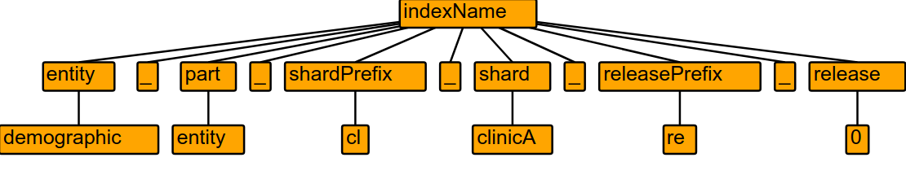

<h1 align="center"> Rollcall </h1><br>

<p align="center">
    A solution for managing data releases, indices, and aliases for Elasticsearch.
</p>

<p align="center">
  <a href="" target="_blank"></a>
</p>

[](https://circleci.com/gh/overture-stack/rollcall)

## Introduction

The purpose of Rollcall is to assist those projects which make use of Elasticsearch as a primary data store to drive rich facet search and powerful search APIs.

Specifically, for the types of data models that require sharding of the domain to support incremental updates, real time updates, testing, and data versioning, there is a need for a comprehensive solution for managing index aliases in an automated fashion. 

Rollcall solves the very specific problem of applying aliases to indexes in a way that makes sense for a sharded domain. 

## Motivating Example

Suppose you are building a search API for patient demographic information across many different clinics and sites and you have decided to store the information as documents in Elasticsearch to make use of the powerful text search and performant aggregations.

Knowing that new clinics will be making data available, others will be making updates to their data at various times, and others will be withdrawing their data, you have decided to shard your domain around the concept of clinic. As such, your Extract-Transform-Load (ETL) pipeline will be producing an Elasticsearch index per clinic.

Example with three clinics:
```
demographic_entity_cl_clinicA_re_0
demographic_entity_cl_clinicB_re_0
demographic_entity_cl_clinicC_re_0
```

For your search API to search across all three indices seamlessly, you create a single index alias for all 3 studies.
```yml
alias: demographic
indices: 
    - demographic_entity_cl_clinicA_re_0
    - demographic_entity_cl_clinicB_re_0
    - demographic_entity_cl_clinicC_re_0
```

Now suppose we want to onboard a new clinic `clinicD` and make an update to an existing one `ClinicB`. We now have to start doing some acrobatics in terms of knowing which index needs an alias removed, which ones need one added, and which ones are untouched. This problem quickly becomes untenable for a human as the number of indices grows. 

This problem is what Rollcall helps solve by introducing concepts like data releases, rollbacks, and redactions in an opinionated way. 

## Index Naming

The thing that Rollcall is opinionated about is the way indices are named. So opinionated in fact that it uses a grammer file to describe the index naming grammer. 

It can be found here: [IndexName.g4](src/main/antlr4/bio/overture/rollcall/antlr4/IndexName.g4)

Using one of the indices from the motivating example, `demographic_entity_cl_clinicA_re_0` this is what a parse tree looks like:


This opinionated way of naming indices allows us to define semantics about the terms in a name which Rollcall uses to manage data releases. It is thanks to this that the index names and aliases are themselves the source of truth and state of the system rather than an external 3rd party acting as a datastore for state and truth.

## Using with Vault

This application can be used with vault to provide secrets for dependency services.

Most configuration of vault follows the spring-cloud-vault [documentation](https://docs.spring.io/spring-cloud-vault/docs/2.2.7.RELEASE/reference/html/#vault.config.backends.configurer). 
However, the generation of vault secrets path is overridden using the `rollcall.vault.secrtsPath` config. This is because the spring default looks for secrets in location that include application-name and active-profiles which requires enabling access to those paths otherwise rollcall will throw errors.

Values are configured in the spring bootstrap context. Example bootsrap.yml usign vault token auth is shown bellow.
```bootstrap.yml
    rollcall.vault.secretsPath: kv/dev/rollcall
    
    spring.cloud.vault:
      enabled: true
      scheme: http
      token: ******TOKEN******
      enabled: true
      host: localhost
      port: 8200
```

Setting things up on the vault end:
- Rollcall has to have at least read access to the path that will be provided in `rollcall.vault.secrtsPath`. 
- keys in vault key-value pair have to match the application.yml variable. (e.g. for `elasticsearch.user` in application.yml key in vault has to be `elasticsearch.user`)
